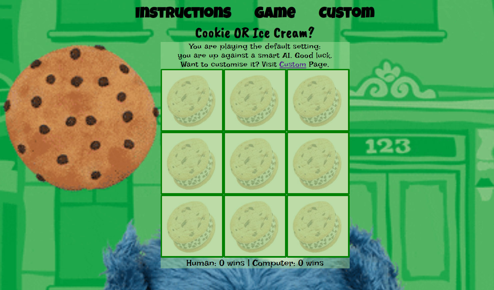
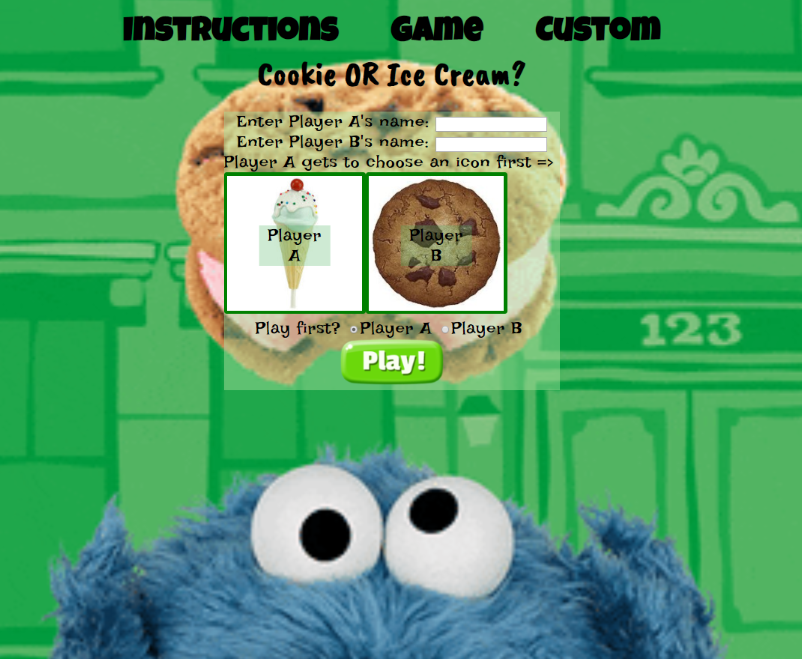
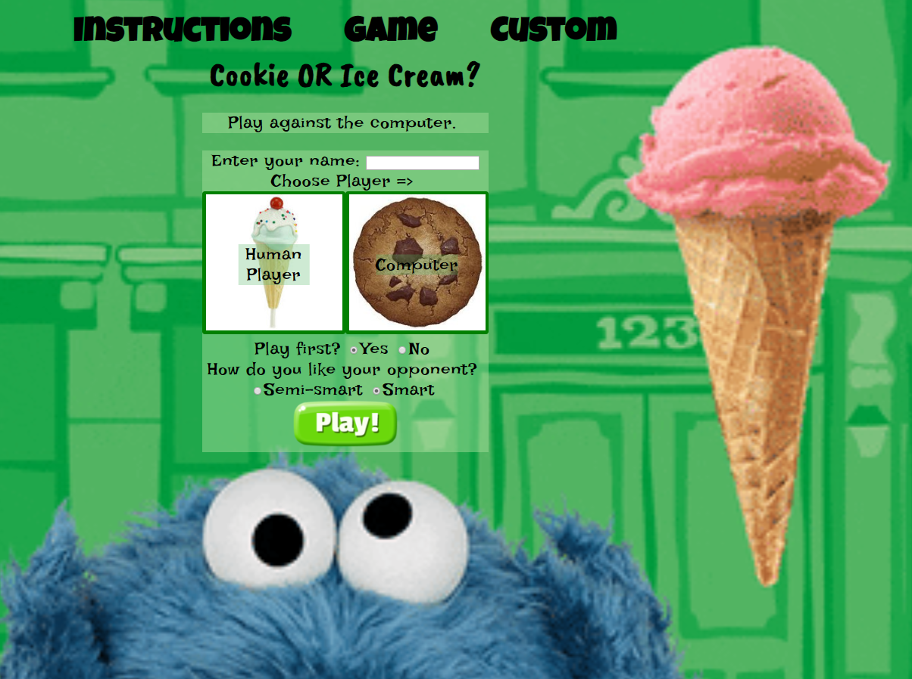
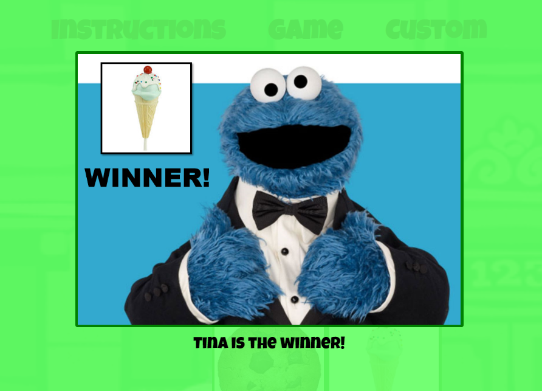

Play the Cookie Monster Tic-Tac-Toe
============

Live: [Cookie Monster Tic-Tac-Toe](https://mmborres.github.io/legendary-broccoli/)
------------

So. Cookie or Ice Cream?
------------

This game is played like a typical Tic-Tac-Toe. 

Upon entering the site, the default game is presented: player is playing against a smart AI, with minimal chances of winning. Tada!

However there are ways to customise the game via the Custom page.

### Player can choose: ###

  * to play against a peer player or computer AI
  * to play against either of two computer AI
    * Semi-smart AI (more chances of player winning)
    * Smart AI (more challenging with minimal chances of winning)
  * be either an Ice Cream (default if not chosen) or Cookie avatar
  * to play first (default) or second (after peer player or computer)
  * to enter name or go by the defaults "Human", "Player A" or "Player B"
  * to play again and score higher

### Technologies ###

This web application uses HTML, CSS, Javascript and jQuery. 

  * Front-end uses HTML utilising Google Fonts and Giphy images
  * Styling and animations through CSS
  * DOM manipulation using Javacript and jQuery
  * Logic and back-end processing using Javascript utilising Data structures and Math library calls
  * Semi-smart AI uses the Mini-Max Algorithm as basis
  * Smart AI uses greedy strategy on top of the Mini-Max algorithm
  * Windows Localstorage is fully supported
  
### Wishlist ###

  * Replace blinking winning row with SVG
  * Implement Firebase or mult-player setup on a network
  * Implement levels and scoring complexity

